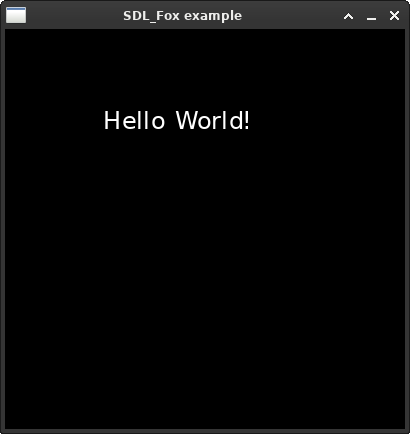

# SDL_fox

 

**Index:**
- [About](#About)
- [Example code](#Example)
- [Installation](#Installation)
- [Documentation](#Documentation)
- [License](#License)

### About

SDL_fox is a utf-8 font rendering library for Simple Direct Media Layer 2.x (SDL2). At its core it is a wrapper around the freetype2 library, making use of fontconfig for resolving font patterns.

### How does it differ from SDL_ttf?

SDL_ttf is another library for handling fonts with SDL. However, unlike SDL_fox, SDL_ttf renders a string of text into an SDL_Surface. Each time the text is modified or requires updating it has to create a new surface (and subsequently that surface is commonly converted into an SDL_Texture) and destroy the old one. This can  certainly be very cumbersome and counterintuitive to use in most applications.

SDL_Fox on the other hand creates a single big texture (called 'atlas') upon loading the font. Each character contained within the font is rendered to that texture and its position and metrics are stored internally. Whenever text is to be drawn, SDL_fox uses the position and metrics of each character to find the respective glyph inside the texture. Then it draws the part of the texture containing the character.

For text-intensive applications with lots of volatile text such as word processors, terminal emulators or videogames SDL_fox provides an easier to use interface - no need to worry about creating and destroying textures each time text is modified. Changing just one character of a large chunk of text requires SDL_ttf to create and render a whole new surface/texture, while SDL_Fox does not do anything, except iterate over a new character and use a different index inside its glyph atlas. Keep in mind that the communication between CPU and GPU is slow, so creating and destroying multiple textures every main loop cycle is not neglible.

Additionally SDL_Fox makes it easier to load fonts according to specified criteria like font name, size and style (bold, italic, etc) by making use of fontconfig. Using fontconfig is optional though, "normal" font loading by path is supported as well.  
Advanced text rendering functions are also implemented, such as the ability to render text inside a SDL_Rect and incrementally displaying a block of text (like in old 2d role-playing videogames).

### Example
```c
// Tabsize 4
#include <SDL2/SDL.h>
#include "SDL_fox.h"

int main(int argc, char *argv[]) {
	SDL_Init(SDL_INIT_VIDEO);
	FOX_Init();

	SDL_Window *window = SDL_CreateWindow("SDL_Fox example", 
			SDL_WINDOWPOS_UNDEFINED, SDL_WINDOWPOS_UNDEFINED,
								400, 400, SDL_WINDOW_SHOWN);
	SDL_Renderer *renderer = SDL_CreateRenderer(window, -1, 0);
	FOX_Font *font = FOX_OpenFontFc(renderer, "DejaVu Sans :style=Bold :size=24");

	for(SDL_bool open = SDL_TRUE; open;) {
		SDL_Event event;
		while(SDL_PollEvent(&event)) {
			if(event.type == SDL_QUIT) {
				open = SDL_FALSE;
			}
		}

		SDL_RenderClear(renderer);
		static const SDL_Point position = {100, 100};
		FOX_RenderText(font, "Hello World!", &position);
		SDL_RenderPresent(renderer);
		SDL_Delay(100);
	}

	FOX_CloseFont(font);
	SDL_DestroyRenderer(renderer);
	SDL_DestroyWindow(window);
	FOX_Exit();
	SDL_Quit();

	return 0;
}
```

Output
-------


That is a lot of code for displaying a simple *"Hello World"* so let's condense it down to only the SDL_fox functions we have used:
```c
FOX_Init();
FOX_Font *font = FOX_OpenFont(renderer, "DejaVu Sans :style=Bold :size=24");
FOX_RenderText(font, "Hello World!", &position);
FOX_CloseFont(font);
FOX_Exit();
```

### Installation

1. `sudo apt install -y make build-essential libsdl2-dev libfontconfig-dev libfreetype-dev`
2. `git clone [REPOSITORY URL]`
3. cd ./SDL_fox
4. `make`
5. `sudo make install` (installs to /usr/local/include not /usr/lib/SDL2)

You may need to edit the Makefile if you are on anything other than debian linux.
Missing steps or adaptation to different systems are given as an exercise to the reader... ;)

#### Build
1. Clone this git repository: `git clone [REPOSITORY URL]`
2. `cd SDL_Fox`
3. `make`
4. `sudo make install` (installs to /usr/local/include not /usr/lib/SDL2)

More detailed instructions can be found in [docs/BUILDING.md](docs/BUILDING.md).

### Documentation

Documentation can be found in [docs/README.md](docs/README.md).  
For an example application have a look at [sdlterm](https://github.com/palomena/sdlterm).

### License
```
MIT License

Permission is hereby granted, free of charge, to any person obtaining a
copy of this software and associated documentation files (the "Software"),
to deal in the Software without restriction, including without limitation
the rights to use, copy, modify, merge, publish, distribute, sublicense,
and/or sell copies of the Software, and to permit persons to whom the
Software is furnished to do so, subject to the following conditions:

The above copyright notice and this permission notice shall be included in
all copies or substantial portions of the Software.

THE SOFTWARE IS PROVIDED "AS IS", WITHOUT WARRANTY OF ANY KIND, EXPRESS
OR IMPLIED, INCLUDING BUT NOT LIMITED TO THE WARRANTIES OF MERCHANTABILITY,
FITNESS FOR A PARTICULAR PURPOSE AND NONINFRINGEMENT. IN NO EVENT SHALL THE
AUTHORS OR COPYRIGHT HOLDERS BE LIABLE FOR ANY CLAIM, DAMAGES OR OTHER
LIABILITY, WHETHER IN AN ACTION OF CONTRACT, TORT OR OTHERWISE, ARISING
FROM, OUT OF OR IN CONNECTION WITH THE SOFTWARE OR THE USE OR OTHER
DEALINGS IN THE SOFTWARE.
```
