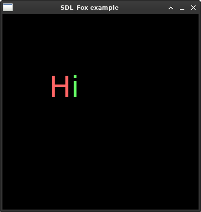
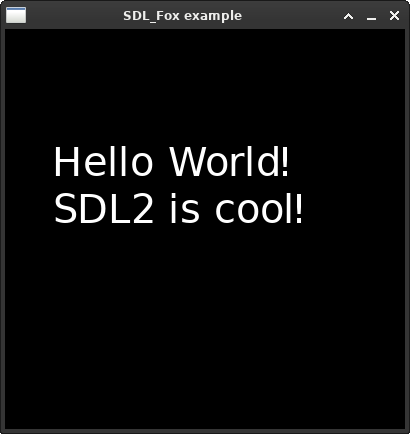
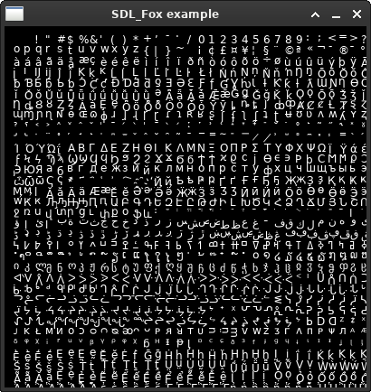

# SDL_fox Documentation

This markdown file serves as the documentation for SDL_fox.  
Use *Ctrl+F* to search for whatever you are looking for.

**Index:**
- [Initialization and Library state](#Initialization-and-Library-state)
	- `FOX_Init(void)`
	- `FOX_Exit(void)`
	- `FOX_WasInit(void)`
- [Loading Fonts](#Loading-Fonts)
	- `FOX_OpenFont()`
	- `FOX_OpenFontEx()`
	- `Fox_CloseFont()`
- [Text Rendering](#Text-Rendering)
	- `FOX_RenderChar()`
	- `FOX_RenderText()`
	- `FOX_RenderTextInside()`
	- `FOX_RenderAtlas()`
- [Font Metrics](#Font-Metrics)
	- `FOX_QueryGlyphMetrics()`
	- `FOX_GetKerningOffset()`
	- `FOX_GetAdvance()`
	- `FOX_EnableKerning()`

## Initialization and Library state

---------
```c
enum FOX_LibraryState {
	FOX_UNINITIALIZED,
	FOX_INITIALIZED
};
```
#### Description
SDL_fox library initialization state:
- `FOX_UNINITIALIZED`: &ensp; SDL_fox is not initialized.
- `FOX_INITIALIZED`: &emsp; &nbsp; SDL_fox is initialized.

---------
```c
enum FOX_LibraryState FOX_Init(void);
```
#### Description
Initializes the SDL_fox library. If the library has been initialized
prior, then nothing is done. Thus it is safe to call it multiple times
even if SDL_fox has already been initialized.  
This function has to be called before using any function not listed
in the [Initialization and Library state](#Initialization-and-Library-state) section.
#### Returns
`enum FOX_LibraryState` indicating the SDL_fox library state.

---------
```c
void FOX_Exit(void);
```
#### Description
De-initializes the SDL_fox library. If the library has __not__ been
initialized prior, then nothing is done. Thus it is safe to call it
multiple times even if SDL_fox has not been initialized.  
This function does not return anything - you can assume that it always
succeeds.

---------
```c
enum FOX_LibraryState FOX_WasInit(void);
```
#### Description
Returns the SDL_fox library state.

## Loading Fonts

---------
```c
typedef struct FOX_Font FOX_Font;
```
#### Description
The `FOX_Font` type represents the internal font representation. The
implementation itself is hidden and only accessible within the *SDL_fox.c*
source file.

---------
```c
FOX_Font* FOX_OpenFont(SDL_Renderer *renderer, const unsigned char *fontstr);
```
#### Description
Loads a font via a fontconfig pattern. The supplied renderer is used
to render the font into an internal texture and subsequently on each
draw call. A font is always tied to one renderer.

#### Arguments
- `renderer`: SDL Renderer
- `fontstr`: fontconfig font pattern

#### Returns
- `FOX_Font*`: Pointer to a font handle
- `NULL`: on error

#### Example
A fontconfig font pattern might look like one of the examples below.
- *fontstr*: `"DejaVu Sans :style=Bold :size=20"`  
- *fontstr*: `"Arial"`  
- *fontstr*: `"Times New Roman :size=10"`

In actual code:
```c
FOX_Font *font = FOX_OpenFont(renderer, "Arial :size=14");
```

---------
```c
FOX_Font* FOX_OpenFontEx(SDL_Renderer *renderer, const char *path, int size);
```
#### Description
Loads a font explicitly via a path to its file and its point size. This
function is also called by *FOX_OpenFont* internally after parsing
the fontconfig pattern.  
If you want **bold**, *italic* or ~~strikethrough~~ fonts you need to load a seperate font for each of the desired style. That is because a font like
"Arial" is not stored inside one file, but split over multiple files - one
for each style. Using fontconfig makes loading fonts easy by no longer
requiring the exact path for each style.

#### Arguments
- `renderer`: SDL renderer
- `path`: file path to the font file
- `size`: font point size ([Wikipedia](https://en.wikipedia.org/wiki/Traditional_point-size_names))

#### Example

```c
//const char *bold = "/usr/share/fonts/truetype/dejavu/DejaVuSansMono-Bold.ttf";
const char *path = "/usr/share/fonts/truetype/dejavu/DejaVuSansMono.ttf";
FOX_Font *font = FOX_OpenFontEx(renderer, path, 14);
```

---------
```c
void FOX_CloseFont(FOX_Font *font);
```
#### Description
"Closes" a font handle. This essentially frees all memory associated
with the font object. It is good practice to close a font handle once
it is no longer required (e.g. when exiting the program).

#### Arguments
- `font`: Fox font handle; can be `NULL`

#### Returns
- `FOX_Font*`: Pointer to a font handle
- `NULL`: on error

---------

## Text Rendering

---------
```c
int FOX_RenderChar(FOX_Font *font, Uint32 ch, Uint32 previous_ch, const SDL_Point *position);
```
#### Description
Prints a character at the given position. To modify its color use
`SDL_SetRenderDrawColor(SDL_Renderer*, Uint8 r, Uint8 g, Uint8 b, Uint8 a);`

#### Arguments
- `font`: SDL_fox font handle
- `ch`: current character (to be printed)
- `previous_ch`: previously printed character or 0 (only relevant for kerning)
- `position`: The x and y coordinate to start printing from. The character
				is rendered down and to the right starting from position (just
				like when rendering a texture to the screen).

#### Returns
- The total x-axis advance in pixels for the given character combination.

#### Example
```c
SDL_SetRenderDrawColor(renderer, 255, 100, 100, 255);
SDL_Point position = {100, 100};
position.x += FOX_RenderChar(font, 'H', 0, &position);
SDL_SetRenderDrawColor(renderer, 100, 255, 100, 255);
FOX_RenderChar(font, 'i', 'H', &position);
SDL_RenderPresent(renderer);
```


---------
```c
void FOX_RenderText(FOX_Font *font, const Uint8 *text, const SDL_Point *position);
```
#### Description
Prints a string of text at the given position. To modify its color use
`SDL_SetRenderDrawColor(SDL_Renderer*, Uint8 r, Uint8 g, Uint8 b, Uint8 a);`

#### Arguments
- `font`: SDL_fox font handle
- `text`: UTF-8 string of text.
- `position`: The x and y coordinate to start printing from. The text
				is rendered down and to the right starting from position (just
				like when rendering a texture to the screen).

#### Example
```c
SDL_SetRenderDrawColor(renderer, 255, 100, 100, 255);
SDL_Point position = {50, 100};
FOX_RenderText(font, "Hello World!\nSDL2 is cool!", &position);
SDL_RenderPresent(renderer);
```


---------
```c
int FOX_RenderTextInside(FOX_Font *font, const Uint8 *text, const Uint8 **endptr, const SDL_Rect *rect, int n);
```
#### Description
Prints a string of text inside of the given rect. If the text does not
fit inside all at once it is printed partially. This is conveyed by
the return value.
To modify its color use
`SDL_SetRenderDrawColor(SDL_Renderer*, Uint8 r, Uint8 g, Uint8 b, Uint8 a);`

#### Arguments
- `font`: SDL_fox font handle
- `text`: UTF-8 string of text.
- `endptr`: Pointer that is set by SDL_fox to the end of the (partially) 				printed string and thus marking start of the next string to print.
- `rect`: The x and y coordinate to start printing from along with a maximum
			width and height. The text is rendered down and to the right
			starting from rect.(x,y) and up to rect.(x,y) + rect.(w,h).
- `n`: The number of characters to print. Useful for implementing some kind
		of oldschool rpg game text scrolling. An example is given below.

#### Returns
- `-1`: The supplied `rect` is not large enough or the font is too big.
- `0`: Everything got printed. Nothing left to print.
- `1`: There is more text to be printed. The `endptr` has been modified to 		indicate the beginning of the new string. It is up to you to set
	`text` equal to `*endptr` and start printing the next "page".
- `2`: There is more text to be printed, but we have not reached the
		limits of the rect yet. Printing has been stopped because
		the maximum number `n` of characters has been reached. Increase
		`n` to continue "scrolling". Swapping `text` to `*endptr` at
		this point will resume at `text[n]`, not necessarily
		at the next page.

#### Example
The example is given in a seperate file: [example.c](../src/example.c).  
It demonstrates oldschool rpg game text scrolling inside a fixed size
rectangular area. The scrolling is achieved by incrementing argument `n`
every 100ms. Once we have reached the end of the current page, we flash
a red rectangle on screen. If we have reached the last page, we flash
a yellow rectangle and start over. Switching to the next page is
triggered by pressing any button.


---------
```c
void FOX_RenderAtlas(FOX_Font *font, SDL_Point *pos);
```
#### Description
Primarily useful for troubleshooting and debugging purposes. Displays
the whole font at once, meaning every single character contained within
that font.

#### Arguments
- `font`: SDL_fox font handle
- `pos`: Position in pixels; Atlas is rendered towards the right and down

#### Example
```c
SDL_Point position = {10, 10};
FOX_RenderAtlas(font, &position);
SDL_RenderPresent(renderer);
```


---------

## Font metrics

---------
```c
typedef struct {
	SDL_Rect rect;
	SDL_Point bearing;
	int advance;
} FOX_GlyphMetrics;
```
#### Description
*FOX_GlyphMetrics* represent the dimensions of a character inside the font.
Using *FOX_QueryGlyphMetrics()* one can get a handle to these dimensions.
Based on and closely related to freetype [*FT_Glyph_Metrics*](https://freetype.org/freetype2/docs/reference/ft2-base_interface.html#ft_glyph_metrics).

#### Fields
- `SDL_Rect rect`: The position and dimensions of the character inside the 						internal font atlas. Only width (rect.w) and height
					(rect.h) should be relevant for external users.
- `SDL_Point bearing`: Have a look at the [freetype documentation](https://freetype.org/freetype2/docs/tutorial/step2.html) on the topic.
- `int advance`: The value by which the cursor on the x-axis gets incremented 					after drawing the character.

---------
```c
const FOX_GlyphMetrics* FOX_QueryGlyphMetrics(FOX_Font *font, Uint32 ch);
```
#### Description
Returns a const handle to FOX_GlyphMetrics for the given character.

#### Arguments
- `font`: SDL_fox font handle
- `ch`: character

#### Returns
- `const FOX_GlyphMetrics*` on success
- `NULL` on error

---------
```c
int FOX_GetKerningOffset(FOX_Font *font, Uint32 ch, Uint32 previous_ch);
```
#### Description
Calculates the kerning offset between two characters `ch` and its
predecessor `previous_ch`. Find out more about kerning by taking a
look at the [Wikipedia article](https://en.wikipedia.org/wiki/Kerning).

#### Arguments
- `font`: SDL_fox font handle
- `ch`: current character
- `previous_ch`: previous character or 0

#### Returns
- The x-axis kerning offset between `ch` and `previous_ch`. May be
	negative, positive or 0.

---------
```c
int FOX_GetAdvance(FOX_Font *font, Uint32 ch, Uint32 previous_ch);
```
#### Description
Calculates the total x-axis advance value for a given character. This
includes the `FOX_GlyphMetrics->advance` value and if a previous character
is supplied and kerning supported and enabled, also the kerning offset.

#### Arguments
- `font`: SDL_fox font handle
- `ch`: Current character
- `previous_ch`: Previously printed character or 0

#### Returns
- The x-axis advance value in pixels for supplied character `ch`

---------
```c
void FOX_EnableKerning(FOX_Font *font, SDL_bool enable);
```

#### Description
This function lets you enable kerning for a font.
[Wikipedia article](https://en.wikipedia.org/wiki/Kerning)  
Kerning is enabled by default, assuming the font supports it. If a font
does not support kerning then any call made to this function has no effect.

#### Arguments
- `font`: SDL_fox font handle
- `enable`: boolean; `SDL_TRUE` to enable, `SDL_FALSE` to disable

---------